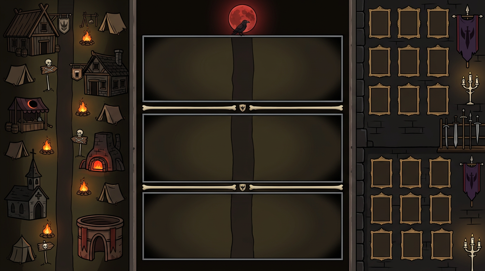
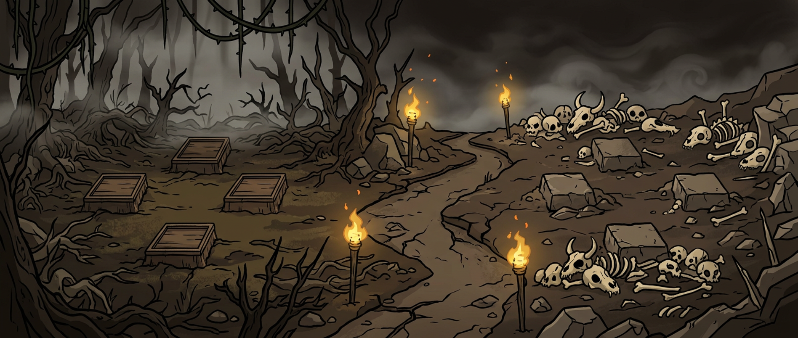

# 暗黑主题 · 整套 UI 大背景 + 三行战斗框体规划

> 项目：宿命旅途 changeForJourney · 三行并行战斗暗黑化
> 状态：规划稿 v2.1（2026-09-13，v2 修正：整套 UI 大背景一张图；中段只做框体（骨条分隔、无洞口），行内容以独立背景填充）
> 关联：`暗黑魔塔改造总体方案.md`（色板/铁律/九宫格）、`横屏三栏并行战斗改造方案.md`（布局基建）
> 样式图：
> - `docs/style/暗黑UI整套大背景概念图v2.png`（★ 整套 UI 大背景 16:9 · 最新）
> - `docs/style/战区横条样式图.png`（行内容背景样式参考）
> - `docs/style/战区内部背景样式参考.png`（行内容背景风格备选）
> - v1 整体概念图已由 v2 取代（v1 的三段战区景深保留为 L1 风格参考）

---

## 一、分层架构（本规划的核心修正）

```
L3  UI 层        HUD 按钮 / 行标签 / 获得弹窗 / 对话框          （已实现）
L2  战斗内容      卡组 / 飘字 / 特效 / 投射物                    （已实现）
L1  行内容背景    每行 948×360 独立背景图，按关卡/章节可换        （本次新增，"另外背景填充"）
L0  整套 UI 大背景  1920×1080 一张整图：左营地建筑群 + 中框体骨架 + 右英灵墙（本次新增，一张图）
```

**职责边界**：
- **L0 一张整图管全局氛围**：左右面板与中段的框体骨架（血月天幕、骨质分隔条、晕影、行军路）全部画在这一张图里——静态、一次绘制、不改战斗代码
- **L1 管战区内部**：每个框体内侧的战场地面，是**独立的背景贴图**，可按章节/关卡替换（暗森林/墓地/深渊…），框缘由 L0 压住，换背景不动框
- 中段只出**框**，框内内容 = L1 填充 —— 这就是"中间只搞框，内容以另外背景填充"

### 概念图 v2（已出）



- **左竖条（486px）= 黑暗军团营地·建筑群**：沿营地道路分布六座暗黑建筑（见下方改名表），沿途帐篷/篝火/骷髅路标
- **右竖条（486px）= 军团英灵墙**：暗色石墙上悬挂空置肖像画框（角色卡牌直接"挂"上墙），配武器架/暗紫军团旗/骨白烛台——与右侧角色列表功能对位
- **中段（948px）= 三个紧邻的石质战斗框**：细窄金属包边，框间仅一条**骨质分隔条（带小纹章）**——无拱门/洞口，简洁 UI 式拆分；框内昏暗占位，等待 L1 填充

### 左侧建筑改名表（功能不变，名称/外观暗黑化）

| 现名（风格不符） | 暗黑名 | 功能（不变） | 外观要素 |
|---|---|---|---|
| 冒险者公会 | **亡誓公会** | 公会页 | 灰烬徽章木厅、断旗 |
| 酒馆 | **腐鸦酒馆** | 招募 | 酒杯招牌、鸦栖檐角 |
| 市场 | **月蚀黑市** | 商店/特权 | 红月纹篷布货摊 |
| 铁匠铺 | **狱火锻炉** | 强化/分解/重铸 | 红光炉口、铁砧 |
| 教堂 | **缄默礼拜堂** | 神器/转职 | 歪斜尖顶、残十字 |
| 竞技场 | **血砂斗场** | 竞技场 | 兽骨拱门、砂地 |
| 训练假人 | **刑架假人** | 训练 | 木架与锁链 |

> 改名只动显示文案与贴图，页面模块/路由/服务端协议零改动。

### 行内容背景样式参考（L1）



每行框内：我方 4 卡位在左半（林间空地）、敌方 4 卡位在右半（骨堆荒地）、中央对峙区 + 行军路。这张图定义了 L1 的美术密度与卡位净空标准。

---

## 二、L0 整套大背景规格（1920×1080 一张整图）

| 区域 | X 范围 | 内容 |
|---|---|---|
| 左竖条（营地建筑群） | 0 – 486 | 六座暗黑建筑沿路分布 + 帐篷/篝火/路标；上缘留 TopBar/导航暗带 |
| 中段框体骨架 | 486 – 1434 | 血月天幕(0-70) + 三个石框 + 两道骨质分隔条 + 中央行军路 + 左右晕影 |
| 右竖条（英灵墙） | 1434 – 1920 | 暗色石墙 + 空置肖像画框阵 + 武器架/旗/烛台；上缘留暗带 |

### 中段框体骨架精确规格

| 元素 | Y 范围（区域内） | 说明 |
|---|---|---|
| 血月天幕 | 0 – 70 | 血月 + 乌鸦 + 暗云；行1 标题衬底 |
| **石框①** | 70 – 382 | 细窄金属包边石框；框内 ≈904×310 留给 L1 |
| 骨质分隔条① | 382 – 404 | 22px 骨白窄条 + 中央小纹章（简洁 UI 拆分，无洞口） |
| **石框②** | 404 – 716 | 同框① |
| 骨质分隔条② | 716 – 738 | 同上 |
| **石框③** | 738 – 1040 | 同框①（底部即 HUD 衬底） |

> 修正：取消 v1 的大拱门/洞口与 40px 交界带——三框紧邻，分隔条收窄为 22px 骨条，空间让给战斗内容。

- **框缘压边**：石框边框画在 L0（框架层），L1 背景塞进框内并被框缘盖住接缝——换 L1 不破框
- **中央行军路**：纵贯三框的路在 L0 上只画"分隔条段"；框内路由 L1 自带（对峙区地面），保证换背景时对峙感不丢
- **晕影**：四角与左右 24px 暗晕，压住 L1 的生硬边缘

---

## 三、L1 行内容背景规格（"另外背景填充"）

| 项 | 规格 |
|---|---|
| 单张尺寸 | 948×360（2 倍图 1896×720 下采样） |
| 内容 | 战区地面 + 我方/敌方半区地形 + 中央对峙区；**卡位区净空**（左右两半中线 ±120px 内低细节） |
| 首批 | ① 腐化森林（默认/第1章） ② 白骨荒原（第2章） ③ 深渊裂隙（第3章） |
| 扩展 | 按章节持续追加，`章节 → L1 贴图` 映射表驱动，换图不改代码 |
| 风格 | 沿用战区横条样式图：粗描边、扁平渐变、骨白骨堆、琥珀火光、边缘暗角 |

---

## 四、色板与铁律（沿用 DarkIcon Palette，不变）

天幕/画布 `#0D0B09` · 主体 `#1C1712→#100D09` · 骨白 `#D8C9A3` · 琥珀金 `#C9973B` · 血红 `#A61E1E` · 余烬橙 `#FF7A28`；粗黑描边 α1.0、渐变只做扁平材质、中心点定位。

---

## 五、实现路径（渲染层分层合成，战斗代码零改动）

```
TriPage.draw（strip 模式）绘制顺序重构：
  L0  整套大背景：一次 nvgImagePattern 铺 1920×1080 整图
      （左右面板与中段不再是三张独立底，共享同一天幕/晕影）
  L1  行内容背景：每行 clip 到框内矩形(≈904×310)，画对应 L1 贴图
      （章节映射表选图；未配章节默认森林）
  L0' 框体框架：石框边框 + 骨质分隔条 + 血月天幕 叠绘在 L1 之上（框缘压边）
  L2  战斗内容：阴影 → 卡组 → 飘字 → 特效 → 投射物（现有，clip 到框内）
  L3  UI：行标签 / HUD / 获得弹窗（现有）
```

- 左右面板绘制改造：营地/英灵墙作为 L0 的一部分铺底后，`TownScene`/`CharacterPanel` 现有的 HorizonBg 调用改为透明/仅画交互件（分两步走，先中段后左右）
- 章节映射：`config/章节 → L1 贴图` 表驱动；`BattleView.draw` 按 `row → 章节` 取图

### 素材需求清单

| 素材 | 尺寸 | 数量 | 说明 |
|---|---|---|---|
| **L0 整套大背景** | 1920×1080 | 1 | 按概念图 v2 出正式版（框体空置、营地建筑群/英灵墙完整） |
| **L1 行内容背景** | 948×360（2 倍图） | 首批 3 张 | 森林/荒原/深渊；卡位区净空 |
| 骨质分隔条 | 948×22 | 2 | 矢量绘制（骨白 + 小纹章，DarkIcon 路线） |
| 框缘强化件（可选） | 石框四角饰件 | 4 | 矢量 DarkIcon 路线，增强石框立体感 |
| 火把动画 | 24×48 ×2 帧 | 2 | 矢量绘制，L0 上叠绘 |

---

## 六、实施阶段

| 阶段 | 内容 | 量 |
|---|---|---|
| M1 | L0 正式整图出图（按概念图 v2）+ BattleTriPage 接入（铺底 + 行 clip 框内） | 大头 |
| M1.5 | 左侧建筑改名表落地（文案 + 贴图暗黑化，功能不动） | 中 |
| M2 | L1 首批三张行背景 + 章节映射表 | 中 |
| M3 | 右侧英灵墙卡牌挂接（角色品质框直接"挂"墙上的画框位） | 中 |
| M4 | 动效（血月云移/骨条微光/火把/火星粒子） | 小 |

## 七、风险与备注

- L0 整图 1920×1080 需保证**三个石框内矩形**与行 clip 矩形逐像素对齐（实现时以代码生成的框体参数反向校对出图，或出图后按代码框线裁切）
- L1 换图接口保留"未配置章节回退默认图"，避免新章节漏配
- 左右面板暗黑化后，其上的亮色 UI 件（品质框/按钮）由九宫格 P1 轨道统一压暗，本规划不重复处理
- AI 生成贴图需逐张校对**卡位区净空**（两侧中线 ±120px 内避免高对比元素）；三张 L1 色调需接近（同 seed 系列/统一后处理），避免"三张不像一张图"
