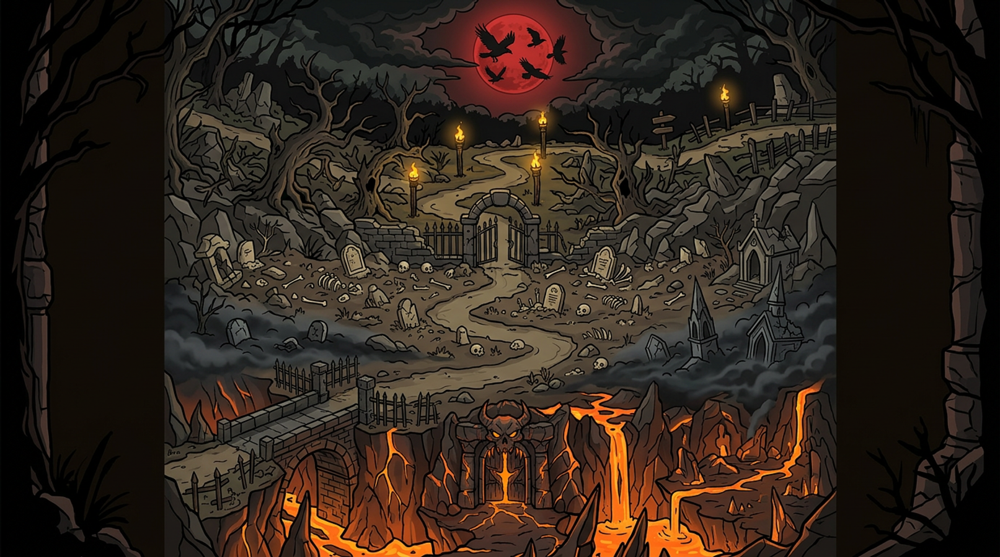

# 暗黑主题 · 大场景地图规划（三行并行战斗）

> 项目：宿命旅途 changeForJourney · 三行并行战斗暗黑化
> 状态：规划稿 v1.0（2026-09-13）
> 关联：`暗黑魔塔改造总体方案.md`（设计语言/色板/铁律）、`横屏三栏并行战斗改造方案.md`（布局基建）
> 样式图：`docs/style/暗黑大场景地图概念图.png`（整体）、`docs/style/战区横条样式图.png`（单战区条带）

---

## 一、核心概念：一张大图，三段战区

现状问题：三行战斗各自拉伸同一张 `MAP_1` 森林图，行与行之间是硬切的黑底，像三张独立贴片。

目标：**中段战斗区（948×1080）变成一张完整连续的暗黑远征大地图**——三行战斗是这张图上的三个战区，一条黑暗行军路纵贯中央，血月悬顶、雾气分界，玩家一眼看到的是"一支远征军的三条战线"，而不是三个格子。

### 概念图（已出）



自上而下四层：
1. **血月天幕**：血红月亮 + 乌鸦剪影 + 暗云（行1 顶部带，兼作队1 标题衬底）
2. **腐化森林战区**（行1）：扭曲枯树、琥珀火把、行军路起点
3. **白骨荒原战区**（行2）：石拱墓门分界、墓碑骨堆、雾气漫地
4. **深渊裂隙战区**（行3）：断桥、恶魔石门、熔岩裂隙余烬光

左右两侧：树影/残柱**暗色晕影边框**（呼应概念图的画框感），把 948px 宽度自然收进画面。

### 单战区条带样式（已出）


每条战区 = 948×360 横条：我方 4 卡位在左半（林间空地）、敌方 4 卡位在右半（骨堆荒地）、中央行军路对峙区投射物飞行。

---

## 二、分区规格（中段 948×1080 精确到像素）

| 分区 | Y 范围 | 高度 | 内容 |
|---|---|---|---|
| 血月天幕带 | 0 – 70 | 70 | 血月(右上) + 乌鸦 + 暗云；行1 队标/导航按钮衬底 |
| **战区① 腐化森林**（行1） | 70 – 380 | 310 | 枯树 + 火把 + 行军路起点；我4敌4 卡线 |
| 交界带① 石拱墓门 | 380 – 420 | 40 | 石拱门 + 雾带（视觉分界，非硬切） |
| **战区② 白骨荒原**（行2） | 420 – 730 | 310 | 墓碑骨堆 + 断裂围墙 + 底部雾 |
| 交界带② 断桥渊缘 | 730 – 770 | 40 | 断桥石栏 + 渊口雾 |
| **战区③ 深渊裂隙**（行3） | 770 – 1040 | 270 | 恶魔石门 + 熔岩裂纹 + 余烬光 |
| 底部暗沿 | 1040 – 1080 | 40 | 暗色石沿/浓雾（行3 血条/按钮衬底） |

> 行高仍是 360（与现有 `BattleLayout.STRIP_H` 一致）；战区画面高度 310 + 交界带 40 = 视觉 350，战场卡线（STRIP_CY=180 局部系）不动——**战斗坐标零改动，纯绘制层换肤**。

### 关键对峙区设计（每条战区）

- **中央行军路**：宽约 100px 的蜿蜒暗路贯穿左右两阵之间——投射物/穿透弹的飞行走廊，天然把视觉焦点引到对峙区
- **我方半区**：地面偏琥珀火光 tint（篝火余温）；**敌方半区**：偏血红/暗紫魔气 tint——用 `nvgImagePatternTinted` 半区叠色实现（P1 压暗方案复用）
- **火把/双眼点缀**：战区左右边缘各 1-2 个火把（琥珀光晕动画帧），暗处偶发余烬橙火星粒子

---

## 三、色板与铁律对齐（沿用 DarkIcon Palette）

| 元素 | 色值 | 用法 |
|---|---|---|
| 天幕/画布底 | `#0D0B09` | 血月带、四角晕影最深色 |
| 战区主体 | `#1C1712 → #100D09` 垂直渐变 | 每条战区地面 |
| 骨白 | `#D8C9A3` | 骨堆、墓碑、石拱、行军路碎石 |
| 琥珀金 | `#C9973B`（亮 `#F0C75E`） | 火把光、路缘高光 |
| 血红 | `#A61E1E`（亮 `#E04848`） | 血月、敌方半区 tint、深渊魔气 |
| 余烬橙 | `#FF7A28` | 熔岩裂纹、火星粒子、火把焰心 |

三条铁律照旧：**粗黑描边定轮廓（α1.0，宽度≈尺寸×3%）**、渐变只做扁平材质、中心点定位。概念图已按此风格出图（卡通粗描边，非写实）。

---

## 四、实现路径（分层合成，不动战斗代码）

### 方案：条带贴图 ×3 + 交界带叠绘

```
BattleView.draw（strip 模式）绘制顺序调整：
  1) 整幅大图底：不再每行单独拉伸 MAP_1，改为
     战区条带图[行号]（948×360 贴图，按行 Y 平移绘制）
  2) 交界带叠绘：两段交界装饰（石拱/断桥/雾带）画在行与行接缝处
  3) 血月天幕：行1 顶部 70px 叠绘
  4) 左右晕影边框：整区域两侧 24px 树影/残柱
  5) 半区 tint：我方半区琥珀 / 敌方半区血红（nvgImagePatternTinted α0.12）
  6) 现有内容照旧：阴影 → 卡组 → 飘字 → 特效 → 投射物
```

- 战斗逻辑/坐标/命中**零改动**（绘制层换肤）
- 每行换绑对应战区贴图后，"关卡推进"仍可后续按章节换图（森林→墓地→深渊对应第 1/2/3 章，本次先按行固定）

### 素材需求清单

| 素材 | 尺寸 | 数量 | 来源 |
|---|---|---|---|
| 战区横条贴图（森林/荒原/深渊） | 948×360 | 3 | AI 生成 + 手动修卡位（样式图已定调） |
| 血月天幕贴片 | 948×70 | 1 | AI 生成裁切 |
| 交界带（石拱/断桥） | 948×40 | 2 | AI 生成裁切或矢量绘制 |
| 左右晕影边框 | 24×1080 | 1 | 矢量绘制（DarkIcon 路线） |
| 火把（2 帧火光） | 24×48 | 2 | 矢量绘制（DarkIcon 路线） |

> 生成贴图注意：卡位区（左右两半中线附近）留空/低细节，避免压住卡牌；统一 2 倍图（1896×720）下采样抗锯齿。

---

## 五、实施阶段

| 阶段 | 内容 | 量 |
|---|---|---|
| M1 | 三张战区条带贴图生成 + BattleView 换绑 + 交界带/天幕/晕影叠绘 | 大头 |
| M2 | 半区 tint + 火把动画 + 雾带动效（慢速平移） | 中 |
| M3 | 左右经营/角色面板暗黑化联动（九宫格 P1 已在做，届时统一） | 随 P1 |
| M4 | 行2/行3 解锁后的视觉差异化（解锁瞬间交界带火把点亮） | 小 |

## 六、风险与备注

- AI 生成的横条贴图需逐张校对**卡位区净空**（两侧中线 ±120px 内避免高对比元素），否则卡牌辨识度下降
- 三行贴图色调需接近（同一 seed 系列生成/统一后处理），避免"三张不像一张图"
- 贴图进 `assets/image/战区/`，注意加入 AssetManifest 预载列表（或惰性加载，参考大图惰性策略）
